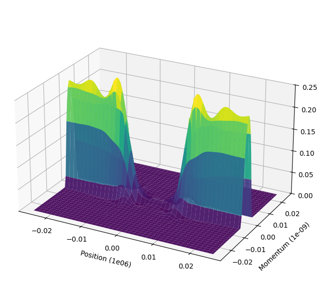

# lww-transport



A reusable Python package for one-dimensional Lattice Weyl-Wigner / Wigner-Poisson quantum transport simulations.

The package implements the reference one-dimensional RTD numerical workflow with a configurable simulator class and explicit CSV I/O.


## Install

Clone the GitHub repository:

```bash
git clone https://github.com/antble/lww-usc.git
cd lww-usc
```

```bash
pip install -e .
```

To build the Sphinx documentation:

```bash
pip install -e ".[docs]"
sphinx-build -b html docs docs/_build/html
```

Optional Numba-compiled kernels can be installed with:

```bash
pip install -e ".[speedups]"
```

The package also includes a C++ kernel extension for matrix assembly and
current/density reductions. The Wigner solve uses reusable LAPACK band storage
internally, so repeated transient steps avoid rebuilding temporary dense or
compact band matrices. Build the extension normally with:

```bash
pip install -e .
```

To enable OpenMP in the C++ extension, rebuild with:

```bash
LWW_TRANSPORT_OPENMP=1 pip install -e .
```

On macOS this requires `libomp`. If it is installed in a non-standard location,
set `LWW_TRANSPORT_OPENMP_INCLUDE` and `LWW_TRANSPORT_OPENMP_LIB`.
At runtime, use `OPENMP_NUM_THREADS` to control the number of OpenMP threads.

## Minimal usage

```python
from lww_transport import LWWConfig, LWW1DSimulator

cfg = LWWConfig(nx=86, n=72, exchange=True, verbose=True)
sim = LWW1DSimulator(cfg)

steady = sim.solve_steady_state(bias=0.0, max_iterations=200)
print(steady.converged, steady.iterations)
print(steady.current[-1])

sim.save_state(steady.state, "lww_output")
```

`LWWConfig` now uses grouped sections internally (`discretization`,
`material`, `geometry`, `operating`, `solver`, and `compute`) while still
supporting the older flat arguments shown above. For example:

```python
cfg = LWWConfig.standard_rtd().with_grid(86, 72).with_bias(0.08)
sim = LWW1DSimulator(cfg)
print(sim.config_summary())
```

For quick tests, use a smaller grid:

```python
cfg = LWWConfig(nx=10, n=8, exchange=False)
sim = LWW1DSimulator(cfg)
state = sim.initial_zero_bias_state()
```

To draw the RTD geometry from the active configuration:

```python
from lww_transport import save_rtd_geometry_image

save_rtd_geometry_image(cfg, "rtd_geometry.png")
```

## CLI

```bash
lww-transport steady --output output --nx 86 --n 72 --bias 0.0
lww-transport transient --output output --nx 86 --n 72 --ivn 45 --itn 1000 --dbias 0.008 --sample-every 10 --verbose
lww-transport geometry --output output --nx 86 --n 72
```

Transient runs print flushed progress lines when `--verbose` is set. Use
`--progress-every` to control how often iteration updates are printed.
The `lww_tcurl_<bias>.csv` files are written incrementally during the run every
`--sample-every` iterations, and state CSV checkpoints are refreshed after each
completed bias point.
Every CLI run prints the full configuration summary and writes it to
`config_summary.txt` inside `--output`.
Use `--backend cpp`, `--backend numba`, or `--backend python` to compare kernel
backends. `--backend auto` prefers C++, then Numba, then the Python fallback.
`--no-numba` is kept as a legacy alias for `--backend python`.

To profile a small transient run:

```bash
python scripts/profile_transient.py --nx 43 --n 36 --ivn 1 --itn 2
python scripts/profile_transient.py --nx 43 --n 36 --ivn 1 --itn 2 --backend cpp
```

## Main API

- `LWWConfig`: all physical, device, discretization, and solver parameters.
- `LWW1DSimulator.initial_zero_bias_state()`: computes the zero-bias Wigner initialization.
- `LWW1DSimulator.solve_steady_state()`: self-consistent Wigner-Poisson steady-state loop.
- `LWW1DSimulator.run_transient()`: transient bias sweep loop.
- `save_state()`, `load_state()`, and `save_transient()`: legacy CSV I/O.
- `save_rtd_geometry_image()`: draw and save the RTD geometry profile.

## Physics Scope

The model solves a one-dimensional Lattice Weyl-Wigner transport equation on a
discrete `x-k` phase-space grid. It combines a kinetic drift operator, a nonlocal
Wigner potential operator, optional relaxation-time scattering, contact boundary
sources, and a self-consistent Poisson update. The main target system is a
double-barrier resonant-tunneling diode, where the simulation can expose
steady-state Wigner functions, density/current profiles, transient current
traces, tunneling, interference, and negative differential resistance.

## Notes

The reference grid (`nx=86`, `n=72`) solves a banded Wigner system with
`6192` unknowns. This is still CPU intensive because every transient step
requires a banded LAPACK factorization. For package tests and development, use a
smaller grid such as `nx=10, n=8`.

## References

If you use this code in your work, cite the following:

1. F. A. Buot and K. L. Jensen, "Lattice Weyl-Wigner formulation of exact many-body quantum-transport theory and applications to novel solid-state quantum-based devices," *Physical Review B*, vol. 42, no. 15, p. 9429, 1990.

2. K. L. Jensen and F. A. Buot, "The methodology of simulating particle trajectories through tunneling structures using a Wigner distribution approach," *IEEE Transactions on Electron Devices*, vol. 38, no. 10, pp. 2337–2347, 1991. https://doi.org/10.1109/16.88522

3. K. L. Jensen and F. A. Buot, "Numerical simulation of intrinsic bistability and high-frequency current oscillations in resonant tunneling structures," *Physical Review Letters*, vol. 66, no. 8, p. 1078, 1991.

4. W. R. Frensley, "Boundary conditions for open quantum systems driven far from equilibrium," *Reviews of Modern Physics*, vol. 62, no. 3, p. 745, 1990. https://doi.org/10.1103/RevModPhys.62.745

5. F. A. Buot, *Nonequilibrium Quantum Transport Physics in Nanosystems: Foundation of Computational Nonequilibrium Physics in Nanoscience and Nanotechnology*. World Scientific, 2009.