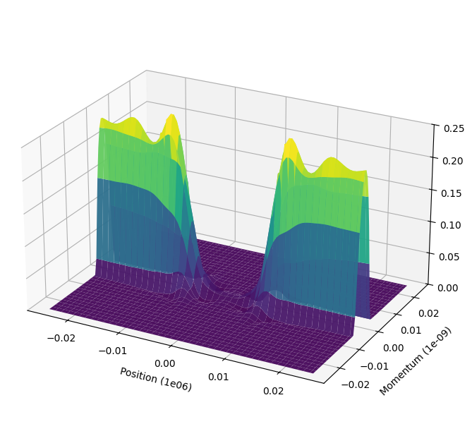

lww-transport
=============

   Wigner distribution function for a symmetric GaAs-AlGaAs-GaAs RTD with 30 Angstrom
   barrier and 50 Angstrom quantum-well widths with zero bias at T = 70K

``lww-transport`` is a reusable Python package for one-dimensional Lattice Weyl-Wigner / Wigner-Poisson quantum transport simulations.

This package is a user-friendly implementation and modernization of the codebase originally developed in Fortran. 
The original work was authored by Dr. Kevin Jensen during his time at the Naval Research Laboratory under the supervision of Prof. Felix Buot.
We acknowledge that the original framework was foundational to this development and encourage users to :doc:`cite the original methodology <citations>` where appropriate.

The package exposes a configurable simulator, legacy CSV I/O, and a command-line interface for steady-state and transient simulations.

.. toctree::
   :maxdepth: 2
   :caption: User Guide

   installation
   physics
   quickstart
   config_guide
   cli
   citations

.. toctree::
   :maxdepth: 2
   :caption: Reference

   config_usage
   api

Indices
-------

* :ref:`genindex`
* :ref:`modindex`
* :ref:`search`
