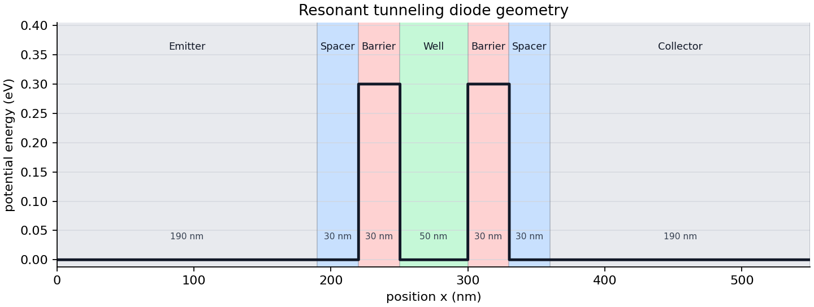
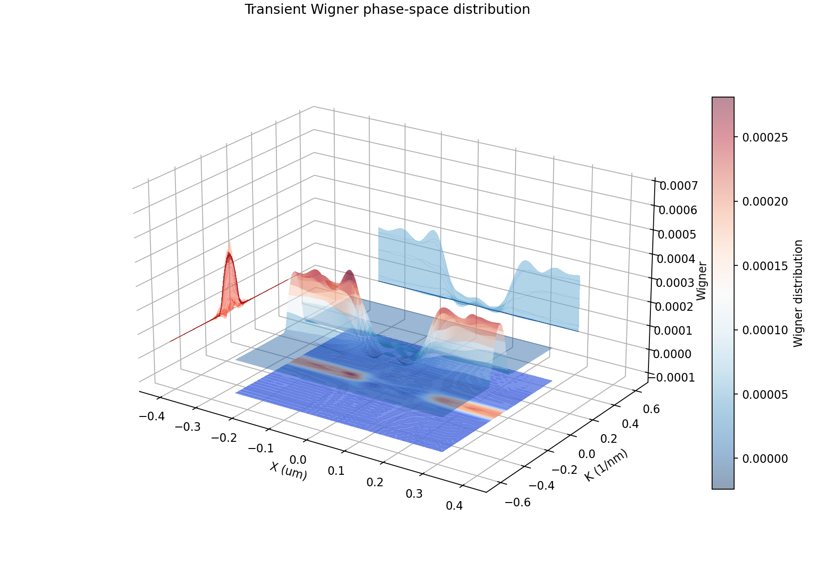

Quickstart
==========

Minimal steady-state run
------------------------

.. code-block:: python

   from lww_transport import LWWConfig, LWW1DSimulator

   cfg = LWWConfig(nx=86, n=72, exchange=True, verbose=True)
   sim = LWW1DSimulator(cfg)

   steady = sim.solve_steady_state(bias=0.0, max_iterations=200)
   print(steady.converged, steady.iterations)
   print(steady.current[-1])

   sim.save_state(steady.state, "lww_output")

Configuration summary
---------------------

``LWWConfig`` is organized into grouped sections while preserving flat keyword
arguments such as ``nx=...`` and ``exchange=...``:

.. code-block:: python

   cfg = LWWConfig.standard_rtd().with_grid(86, 72).with_bias(0.08)
   sim = LWW1DSimulator(cfg)
   print(sim.config_summary({"mode": "steady"}))

CLI simulations print the same summary and write ``config_summary.txt`` to the
output directory. Direct transient runs also save the summary when
``output_dir`` is supplied.

Geometry image
--------------

The geometry helper draws the resonant tunneling diode profile from the active
``LWWConfig``:

.. code-block:: python

   from lww_transport import LWWConfig, save_rtd_geometry_image

   cfg = LWWConfig.standard_rtd()
   save_rtd_geometry_image(cfg, "rtd_geometry.png")

The command line interface provides the same output:

.. code-block:: bash

   lww-transport geometry --output output --nx 86 --n 72

Wigner phase-space image
------------------------

The visualization module can draw a 3D Wigner phase-space surface with a
contour projection and save the image directly. The example image below was
generated from ``output_time_dependent/lww_pywigner.csv`` from a
transient run:

.. code-block:: python

   from lww_transport import (
       LWWConfig,
       LWW1DSimulator,
       save_wigner_phase_space_image,
   )

   cfg = LWWConfig(nx=86, n=72, exchange=True)
   sim = LWW1DSimulator(cfg)
   state = sim.initial_zero_bias_state()

   save_wigner_phase_space_image(
       state.f,
       "wigner_phase_space.png",
       cfg=cfg,
       title="Zero-bias Wigner phase space",
       style="floating",
       surface_alpha=0.45,
       colorbar_label="Wigner distribution",
   )

Saved state CSV files can be plotted without loading the simulator state
manually:

.. code-block:: python

   save_wigner_phase_space_image(
       "lww_output/lww_pywigner.csv",
       "lww_output/wigner_phase_space.png",
       cfg=cfg,
   )

Small-grid smoke run
--------------------

The reference grid builds a large Wigner system. Smaller grids are appropriate
for development checks:

.. code-block:: python

   cfg = LWWConfig(nx=10, n=8, exchange=False, verbose=True)
   sim = LWW1DSimulator(cfg)

   steady = sim.solve_steady_state(bias=0.0, max_iterations=20)
   transient = sim.run_transient(
       steady.state,
       ivn=3,
       itn=30,
       dbias=0.008,
       sample_every=5,
       progress_every=5,
   )

   sim.save_transient(transient, "lww_output")

Profiling
---------

Use the profiling helper to compare the C++, Numba, and Python assembly
backends. All three paths use the same direct LAPACK banded solve; the backend
choice controls matrix assembly and current/density reductions:

.. code-block:: bash

   python scripts/profile_transient.py --nx 43 --n 36 --ivn 1 --itn 2 --backend cpp
   python scripts/profile_transient.py --nx 43 --n 36 --ivn 1 --itn 2 --backend numba
   python scripts/profile_transient.py --nx 43 --n 36 --ivn 1 --itn 2 --backend python

Legacy CSV output
-----------------

``save_state`` writes the following CSV files to the output directory:

* ``lww_pypoten.csv`` — electrostatic potential ``rvs``
* ``lww_pydensity.csv`` — carrier density
* ``lww_pycurrent.csv`` — current density profile ``J(x)``
* ``lww_pywigner.csv`` — Wigner distribution ``f`` (flattened)
* ``lww_pywigner_ss.csv`` — steady-state reference Wigner ``fr`` (flattened)

``save_transient`` writes transient current traces named
``lww_tcurl_<bias>.csv``, where ``<bias>`` is formatted to four decimal
places (e.g. ``lww_tcurl_0.0080.csv``).

When ``run_transient`` receives an ``output_dir`` value, it writes those
``lww_tcurl_<bias>.csv`` files incrementally every ``sample_every`` iterations.
It also refreshes the state CSV checkpoint files after each completed bias
point.
